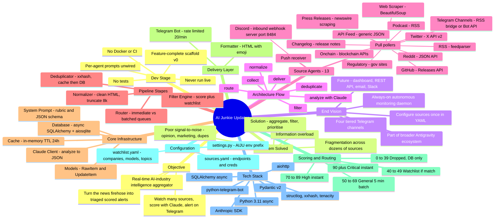

# AI Junkie Updates — Full Mind Map

> A complete map of the project: its purpose, architecture, every component, how
> data flows, and its current development stage. Derived directly from the
> codebase (~3,000 lines across 72 files).

---

## 1. Visual Mind Map (Mermaid)



---

## 2. Detailed Text Outline (full fidelity)

```
AI JUNKIE UPDATES
│
├── 1. CORE OBJECTIVE
│   └── A real-time AI-industry intelligence aggregator: continuously watches
│       public sources, scores every item with Claude, and pushes the items
│       worth knowing to tiered Telegram channels.
│
├── 2. PROBLEM IT SOLVES
│   ├── Information overload — too much AI news to follow manually
│   ├── Fragmentation — news scattered across 13+ source types
│   ├── Poor signal-to-noise — most content is opinion / marketing / duplication
│   └── Strategy: AGGREGATE → FILTER (Claude) → PRIORITISE (tiered delivery)
│
├── 3. END VISION
│   ├── Always-on autonomous daemon a single person/team runs
│   ├── Configure sources once (YAML) + a personal watchlist
│   ├── Four Telegram channels: Critical / High / General / Watchlist
│   ├── Part of the broader "Antigravity" ecosystem (per CLAUDE.md)
│   └── Backlog hints at a larger platform: web dashboard, REST API,
│       email digests, Slack delivery, Postgres
│
├── 4. END-TO-END ARCHITECTURE (one async event loop)
│   main.py
│   ├── bootstrap()  → validate env, create DB tables, warm cache
│   ├── instantiate all 13 agents
│   ├── router.start_flush_loops()  → 5-min general + 15-min watchlist queues
│   └── run all agents concurrently under Semaphore(MAX_CONCURRENT_AGENTS=5)
│       │
│       └── per agent.run() loop (forever):
│           collect() → [RawItem...]
│             → Normalizer.normalize()      (clean & truncate to 8k chars)
│             → Deduplicator.is_duplicate() (xxhash → cache → DB; drop if seen)
│             → claude_client.analyze()     (Claude → JSON → UpdateItem)
│             → FilterEngine.should_deliver()(score + watchlist → channel)
│             → router.route()
│                 ├── CRITICAL/HIGH → telegram_bot.send() immediately → save DB
│                 ├── GENERAL       → buffer, flush at 10 items or every 5 min
│                 ├── WATCHLIST     → buffer, flush every 15 min
│                 └── DROPPED       → save to DB only (no send)
│             → sleep(POLL_INTERVAL=300s) and repeat
│
├── 5. SOURCE AGENTS (13, all fully implemented — agents/)
│   ├── base_agent.py — abstract BaseAgent; owns the shared pipeline; each
│   │     subclass only implements collect() -> List[RawItem]
│   │
│   ├── PULL-BASED POLLERS (poll on shared interval, default 300s)
│   │   ├── Twitter            — Twitter/X API v2 search (from: + search terms)
│   │   ├── RSS                — feedparser + aiohttp; 13 feeds (TechCrunch,
│   │   │                         arXiv, OpenAI/Anthropic blogs, …)
│   │   ├── GitHub             — REST API /releases for 10 ML repos
│   │   ├── Reddit             — Reddit JSON API; AI subreddits
│   │   ├── On-chain           — explorer APIs: Bittensor, Fetch.ai, Ocean, Render
│   │   ├── Web Scraper        — aiohttp + BeautifulSoup; company news pages
│   │   ├── Changelog          — product changelogs & release notes
│   │   ├── Press Releases     — scraping w/ CSS selectors: PR Newswire,
│   │   │                         BusinessWire, GlobeNewswire, SEC EDGAR
│   │   ├── Regulatory         — scraping: FTC, EU AI Office, NIST, UK DSIT, EP
│   │   ├── Podcast            — RSS: Lex Fridman, TWIML, Practical AI, …
│   │   ├── API Feed           — generic paginated JSON: Crunchbase, PitchBook,
│   │   │                         NewsAPI
│   │   └── Telegram Channels  — RSS bridge or Telegram Bot API (config empty)
│   │
│   └── PUSH-BASED RECEIVER
│       └── Discord            — runs its own aiohttp HTTP server on port 8484;
│                                a user's Discord bot POSTs messages in (avoids
│                                ToS-violating scraping)
│
│   NOTE: every agent folder has a prompt.py with AGENT_CONTEXT_PROMPT, but
│         these are NOT imported/used anywhere — only the master SYSTEM_PROMPT
│         is sent to Claude. (Listed as unfinished in TODO.md.)
│
├── 6. PIPELINE STAGES (pipeline/)
│   ├── Normalizer    — clean_html, remove control chars, collapse whitespace,
│   │                    truncate to MAX_CONTENT_LENGTH = 8000
│   ├── Deduplicator  — generate xxhash fingerprint; check in-memory cache,
│   │                    then DB; 24h TTL; sets raw_item.fingerprint
│   ├── Filter Engine — deterministic thresholds + watchlist match on
│   │                    tags / source_name → returns (should_deliver, channel)
│   └── Router        — immediate send for Critical/High; batched queues for
│                        General (10 items / 5 min) and Watchlist (15 min);
│                        persists every item's status to the DB
│
├── 7. CORE INFRASTRUCTURE (core/)
│   ├── claude_client.py  — async Anthropic client; sends content + SYSTEM_PROMPT;
│   │                        expects strict JSON; tenacity retries (3x backoff);
│   │                        _fallback_item() marks irrelevant on parse failure;
│   │                        lazy init (avoids token validation at import)
│   ├── database.py       — async SQLAlchemy + aiosqlite; single `updates` table;
│   │                        save/update, status updates, fingerprint lookup,
│   │                        recent-item queries
│   ├── cache.py          — in-memory TTL cache (24h default); fast dedup +
│   │                        per-agent "already seen" keys
│   ├── models.py         — Pydantic RawItem & UpdateItem + UpdateRecord ORM
│   │                        with bidirectional converters
│   └── prompts/system_prompt.py — the single master prompt: what to collect,
│                            what to filter, 0–100 rubric, exact JSON schema
│
├── 8. DELIVERY LAYER (delivery/)
│   ├── telegram_bot.py — rate-limited (20 msg/min sliding window); tenacity
│   │                      retries; lazy bot init; channel → chat-id map
│   └── formatter.py    — HTML Telegram messages; per-category emoji; headline,
│                          summary, tags, source link, score line
│
├── 9. DATA MODEL
│   ├── RawItem      — id, source_type, source_name, source_url, raw_content,
│   │                   collected_at, metadata, fingerprint
│   ├── UpdateItem   — + is_relevant, category, urgency, score (0–100), headline,
│   │                   summary, reasoning, tags, pipeline_status,
│   │                   delivery_channel, delivered_at
│   ├── UpdateRecord — SQLAlchemy ORM mapping to `updates` table
│   └── Enums (constants.py)
│       ├── SourceType        — 13 values (one per agent)
│       ├── UpdateCategory     — PRODUCT_LAUNCH, MODEL_RELEASE, FUNDING,
│       │                         ACQUISITION, OPEN_SOURCE_RELEASE,
│       │                         RESEARCH_BREAKTHROUGH, INFRASTRUCTURE_CHANGE,
│       │                         SECURITY_INCIDENT, REGULATORY_DEVELOPMENT,
│       │                         PARTNERSHIP, LEADERSHIP_CHANGE, MARKET_DATA, OTHER
│       ├── UrgencyLevel       — CRITICAL, HIGH, MEDIUM, LOW
│       ├── PipelineStatus     — RAW → NORMALIZED → DEDUPLICATED → ANALYZED →
│       │                         FILTERED → DELIVERED / DROPPED
│       └── DeliveryChannel    — CRITICAL_ALERTS, HIGH_PRIORITY, GENERAL,
│                                 WATCHLIST, DROPPED
│
├── 10. SCORING & ROUTING (Claude assigns score; logic routes it)
│   ├── 90–100  Industry-changing → CRITICAL_ALERTS  → instant
│   ├── 70–89   Very important    → HIGH_PRIORITY    → instant
│   ├── 50–69   Worth knowing     → GENERAL          → 5-min batch
│   ├── 40–49   Minor relevance   → WATCHLIST        → only if watchlist match
│   └── 0–39    Noise             → DROPPED          → saved to DB, not sent
│
├── 11. CONFIGURATION
│   ├── config/sources.yaml   — per-agent source lists, endpoints, credential
│   │                            placeholders (${ENV_VAR})
│   ├── config/watchlist.yaml — companies, models, topics (matched on tags/source)
│   ├── settings.py           — Pydantic-settings, AIJU_ env prefix, hard-exit on
│   │                            missing required keys; CLAUDE_MODEL default
│   │                            "claude-opus-4-5"; POLL_INTERVAL=300;
│   │                            MAX_CONCURRENT_AGENTS=5
│   └── .env.example          — required env var template
│
├── 12. UTILITIES & SINGLETONS
│   ├── utils/logger.py       — structlog, event-based logging
│   ├── utils/fingerprint.py  — xxhash content fingerprinting
│   ├── utils/text_cleaner.py — HTML strip, whitespace, truncate, control chars
│   └── Singletons (module-level): settings, db, cache, claude_client (lazy),
│       telegram_bot (lazy), router
│
├── 13. TECH STACK
│   ├── Python 3.11+ (fully async/await)
│   ├── Anthropic SDK (Claude analysis)
│   ├── Pydantic v2 + pydantic-settings
│   ├── SQLAlchemy (async) + aiosqlite
│   ├── aiohttp (async HTTP / Discord webhook server)
│   ├── python-telegram-bot (delivery)
│   ├── feedparser (RSS), BeautifulSoup + lxml (scraping)
│   ├── xxhash (dedup), structlog (logging), tenacity (retries)
│   └── PyYAML (config)
│
└── 14. DEVELOPMENT STAGE
    ├── DONE
    │   ├── All 13 agents, full pipeline, Claude analysis, Telegram delivery
    │   ├── Persistence, caching, config, logging, graceful shutdown
    │   ├── No stub/placeholder code; imports verified
    │   └── Docs: README, 13 wiki pages, CLAUDE.md, TODO.md
    └── NOT DONE
        ├── Zero tests (no unit/integration/e2e, no pytest config)
        ├── No Docker, CI/CD, health check, or metrics
        ├── No web dashboard / REST API
        ├── No DB migrations (Alembic); SQLite only
        ├── Per-agent prompt injection scaffolded but unwired
        └── Never verifiably run against live sources (needs real API keys +
            4 configured Telegram channels)
    SUMMARY: a feature-complete v0 scaffold — architecture fully realised and
             internally consistent, but untested and not yet run in production.
```
